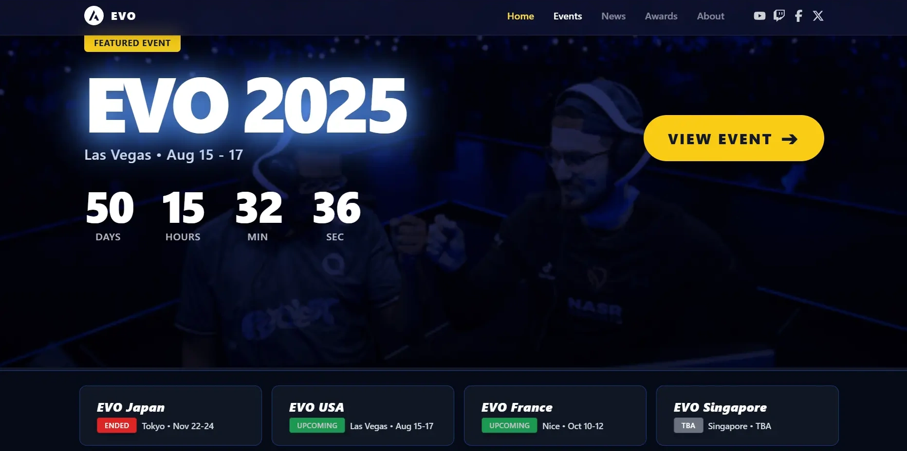

# 🎮 EVO Event Website

A modern, responsive website for the Evolution Championship Series (EVO) fighting game tournaments. Built with React, featuring dynamic event pages, interactive components, and a sleek design optimized for all devices.



## ✨ Features

### 🌟 Core Functionality
- **Dynamic Event Pages** - Individual pages for each EVO location (Japan, USA, France, Singapore)
- **Responsive Design** - Fully optimized for mobile, tablet, and desktop
- **Interactive Components** - Carousels, animations, and smooth transitions
- **Modern UI/UX** - Glassmorphism effects, gradients, and hover animations

### 🎯 Key Components
- **Event Navigation Bar** - Sticky navigation with event cards
- **Featured Games Grid** - Showcase of tournament games with badges
- **Activities Carousel** - Interactive showcase of event activities
- **Hotel Packages** - Pricing and booking information
- **FAQ Section** - Expandable questions and answers
- **Loading Animation** - Elegant first-load experience

### 📱 Responsive Features
- **Mobile-First Design** - Optimized touch interactions
- **Adaptive Layouts** - Grid systems that scale seamlessly
- **Performance Optimized** - Lazy loading and efficient rendering
- **Cross-Browser Compatible** - Works on all modern browsers

## 🛠️ Tech Stack

- **Framework:** React 18
- **Routing:** React Router DOM
- **Styling:** Tailwind CSS
- **Animations:** Framer Motion
- **Icons:** React Icons (FontAwesome 6)
- **Build Tool:** Vite
- **Package Manager:** pnpm

## 🚀 Quick Start

### Prerequisites
- Node.js (version 16 or higher)
- pnpm (recommended) or npm

### Installation

1. **Clone the repository**
   ```bash
   git clone https://github.com/yourusername/evo-event-website.git
   cd evo-event-website
   ```

2. **Install dependencies**
   ```bash
   pnpm install
   # or
   npm install
   ```

3. **Start development server**
   ```bash
   pnpm dev
   # or
   npm run dev
   ```

4. **Open in browser**
   ```
   http://localhost:5173
   ```

## 📁 Project Structure

```
src/
├── components/          # Reusable UI components
│   ├── EventBanner.jsx     # Hero banners for events
│   ├── EventFeatured.jsx   # Featured games grid
│   ├── EventActivities.jsx # Activities carousel
│   ├── EventHotel.jsx      # Hotel packages
│   ├── EventFaqs.jsx       # FAQ accordion
│   ├── Navbar.jsx          # Navigation component
│   ├── Footer.jsx          # Site footer
│   └── ...
├── pages/               # Page components
│   ├── HomePage.jsx        # Landing page
│   ├── EventsPage.jsx      # Events listing
│   └── events/
│       ├── EventPage.jsx       # Dynamic event page
│       ├── EventTemplate.jsx   # Event page template
│       └── ...
├── data/                # Static data
│   └── events.js           # Event data configuration
└── assets/              # Static assets
```

## 🎮 Event Configuration

Events are configured in `src/data/events.js`. Each event includes:

```javascript
{
  slug: "japan",
  title: "EVO JAPAN",
  date: "Tokyo • Nov 22 - 24",
  status: "UPCOMING",
  banner: {
    background: "/backgrounds/back-japan.png",
    city: "Tokyo",
    date: "Nov 22 - 24",
    countdown: { months: "05", days: "20", hours: "08" }
  },
  featured: [/* featured games */],
  activities: [/* event activities */],
  hotel: {/* hotel packages */},
  // ... more configuration
}
```

## 🎨 Customization

### Adding New Events
1. Add event data to `src/data/events.js`
2. Add background image to `public/backgrounds/`
3. The dynamic routing will automatically create the page

### Styling
- Main styles: `src/index.css`
- Custom utilities: `src/custom.css`
- Tailwind config: `tailwind.config.js`

### Components
All components are modular and accept props for easy customization.

## 📱 Responsive Breakpoints

```css
/* Mobile First Approach */
sm: 640px   /* Small devices */
md: 768px   /* Medium devices */
lg: 1024px  /* Large devices */
xl: 1280px  /* Extra large devices */
```

## 🚀 Deployment

### Vercel (Recommended)
1. Push to GitHub
2. Connect repository to Vercel
3. Deploy with default settings

### Manual Build
```bash
pnpm build
# or
npm run build
```

## 🤝 Contributing

1. Fork the repository
2. Create a feature branch (`git checkout -b feature/amazing-feature`)
3. Commit changes (`git commit -m 'Add amazing feature'`)
4. Push to branch (`git push origin feature/amazing-feature`)
5. Open a Pull Request

## 📝 License

This project is licensed under the MIT License - see the [LICENSE](LICENSE) file for details.

## 🎯 Roadmap

- [ ] Add real-time tournament brackets
- [ ] Integrate with streaming platforms
- [ ] Add player profiles and statistics
- [ ] Implement registration system
- [ ] Add live chat during events

## 📞 Contact

**Developer:** [Your Name]
- GitHub: [@yourusername](https://github.com/yourusername)
- Email: your.email@example.com
- Portfolio: [yourportfolio.com](https://yourportfolio.com)

---

Built with ❤️ for the FGC (Fighting Game Community)

## 🏆 Acknowledgments

- **EVO Championship Series** - For inspiring this project
- **Fighting Game Community** - For the amazing tournaments
- **React Community** - For the excellent ecosystem
- **Tailwind CSS** - For the utility-first CSS framework